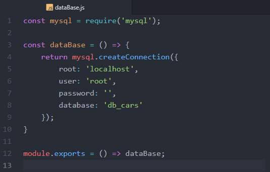
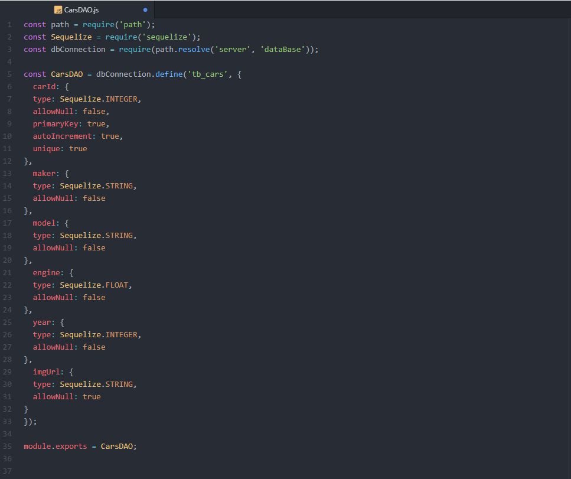

* <h1>Projeto CCC (challenge-33)</h1>
* <h2>projeto completo na branch master.</h2>
 

  Este projeto consiste de um sistema simples de cadastro de carros, usando no front-end o framework <a href="https://getbootstrap.com/">Bootstrap</a> para estilizar a página e deixá-la responsiva e a biblioteca pessoal DOM( $ ) para uso em Javascript para validar os campos e o requisições AJAX para o nome e telefone da empresa no topo da página.

  E para o back-end, usamos a plataforma NodeJS para uso de Javascript usando o framework <a href="https://expressjs.com/pt-br/">Express</a> e módulos auxiliares(EJS, Consign, express-validator, body-parser) e banco de dados <a href="https://www.mysql.com/">MySQL</a>.

  Na página inicial temos um formulário para cadastro de carro, onde informaremos os dados a serem informados e logo abaixo,
  temos a tabela de carros que estão cadastrados no banco de dados, onde cada linha é um registro e acompanha uma imagem com link para a mesma e um botão para remover o registro. Neste projeto podemos listar, inserir e remover registros do banco 
  

  Para começar a testar este projeto, será necessário realizar a conexão com o banco de dados MySQL ajustando os parâmetros no arquivo ./server/dataBase.js alterando para os dados do banco local. 
   
  Após isso executar o código SQL abaixo que irá criar a database e a tabela necessária para funcionar o projeto. 
   

  Por fim, para subir o site do projeto basta iniciar o servidor do MySQL e no terminal do projeto, executar o comando <strong>npm run ccc</strong> e acessar em qualquer navegador o endereço localhost:3000.

