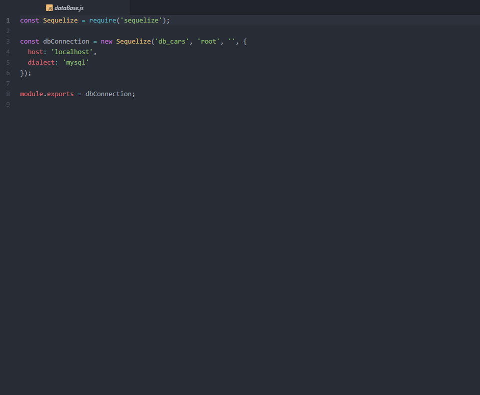

* <h1>Projeto CCC (challenge-33)</h1>
* <h2>projeto completo na branch master.</h2>
 

  Este projeto consiste de um sistema simples de cadastro de carros, usando no front-end o framework <a href="https://getbootstrap.com/">Bootstrap</a> para estilizar a página e deixá-la responsiva e a biblioteca pessoal DOM( $ ) para uso em Javascript para validar os campos e o requisições AJAX para o nome e telefone da empresa no topo da página.

  E para o back-end, usamos a plataforma NodeJS para uso de Javascript usando o framework <a href="https://expressjs.com/pt-br/">Express</a> e módulos auxiliares(EJS, Consign, express-validator, body-parser) e banco de dados <a href="https://www.mysql.com/">MySQL</a>. 
  Para auxiliar a conexão e manipulação do banco de dados, foi utilizado o ORM <a href="http://docs.sequelizejs.com/">Sequelize</a> para abstração da lógica aplicada a base de dados, separando assim a lógica de negócio da lógica de dados do MySQL. Lembrando que é possivel alterar o banco de dados relacional e caso seja feito, basta acrescentar o dialeto no arquivo de 'server/dataBase.js' no atributo 'dialect' do arquivo.

  Na página inicial temos um formulário para cadastro de carro, onde informaremos os dados a serem informados e logo abaixo,
  temos a tabela de carros que estão cadastrados no banco de dados, onde cada linha é um registro e acompanha uma imagem com link para a mesma e um botão para remover o registro. Neste projeto podemos listar, inserir e remover registros do banco 
  

  A conexão com o banco de dados agora é gerenciada pelo Sequelize. Abaixo fica definida a configuração do ORM para a conexão do banco: 
   
  Agora basta definirmos a tabela 'tb_cars' através do model CarsDAO que através do Sequelize irá criar a tabela no banco caso a mesma não exista. 
   

  Por fim, para subir o site do projeto basta instalar as dependências do NodeJS através do comando <strong>npm i</strong> e iniciar o servidor do MySQL, em seguida, no terminal do projeto, executar o comando <strong>npm run ccc</strong> e acessar em qualquer navegador o endereço localhost:3000.

  Novas features serão incluidas como EDITAR, FILTRAR e requisições AJAX para evitar reload total da página. Uma mesma versão desde pequeno projeto particular será feita usando o banco de dados <a href="https://www.mongodb.com/">MongoDB</a> para armazenar os dados. <strong>Vida Longa ao JAVASCRIPT!!! :D</strong>

